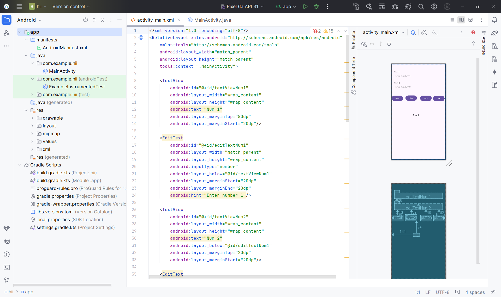

# simple_login

This is a simple calculator program that provides a user-friendly interface for performing basic arithmetic operations. It supports essential mathematical functions like addition, subtraction, multiplication, and division, allowing users to efficiently solve numerical problems.

## Features

- Addition (+)
- Subtraction (-)
- Multiplication (*)
- Division (/)

## Usage

The specific instructions for using the calculator will depend on the programming language or platform it's implemented on.

Here are some general guidelines:

- Input: Enter the numbers you want to calculate with. This might involve typing them into a console, clicking buttons on a graphical - 
- interface, etc.
- Operator: Select the desired operation (addition, subtraction, multiplication, or division) using a corresponding button, symbol, or menu option.
-- Calculate: The program will perform the calculation and display the result.
## Screenshots

